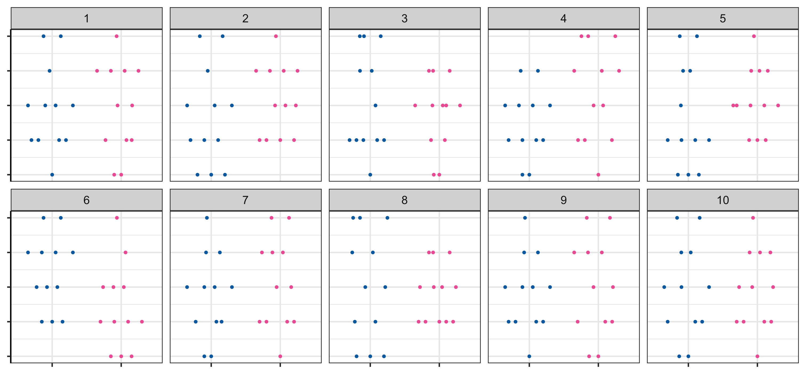
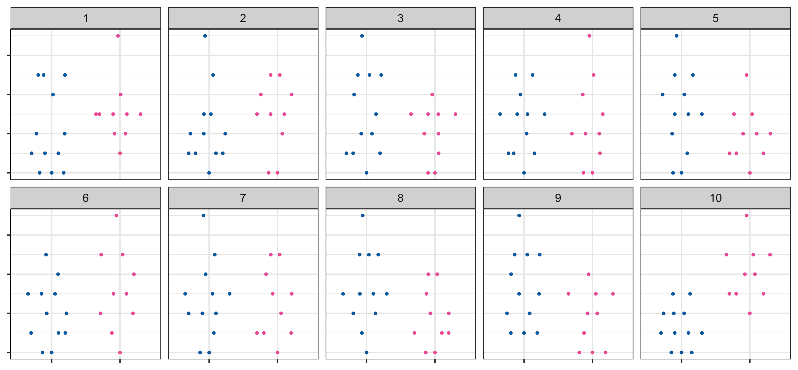
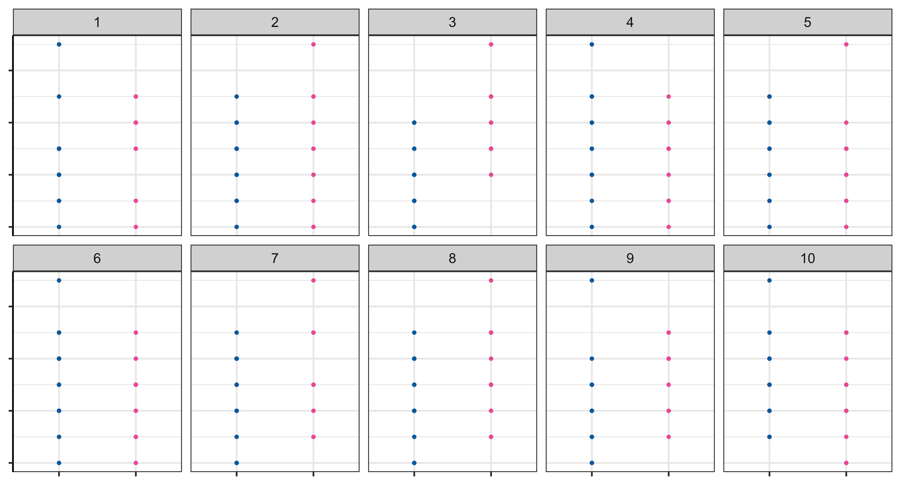
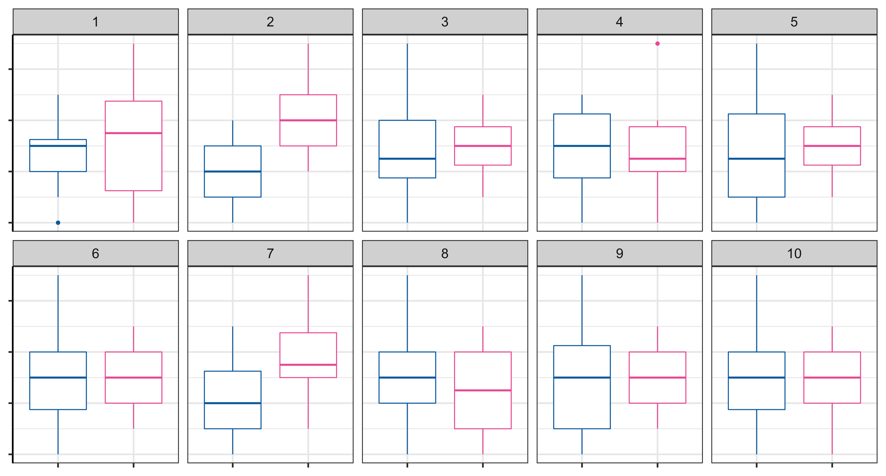
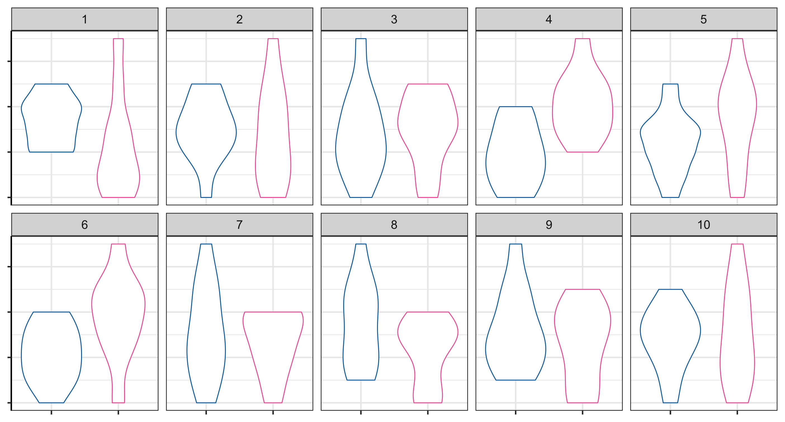
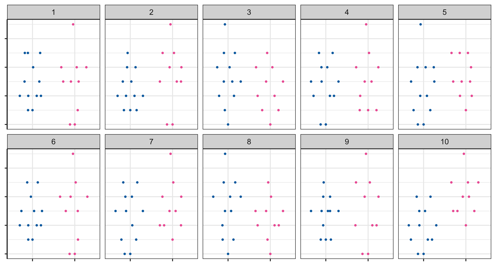

```{r, include = FALSE}
current_file <- knitr::current_input()
basename <- gsub(".Rmd$", "", current_file)
```
```{r, include = FALSE}
library(tidyverse)
library(colorspace)
library(patchwork)
library(nullabor)
library(grid)
library(broom)
options(width = 200)
knitr::opts_chunk$set(
  fig.path = "images/week12A/",
  fig.width = 6,
  fig.height = 6,
  fig.align = "center",
  dev.args = list(bg = 'transparent'),
  #out.width = "100%",
  fig.retina = 3,
  echo = FALSE,
  warning = FALSE,
  message = FALSE,
  cache = TRUE,
  cache.path = "cache/week12AB/"
)
theme_set(theme_bw(base_size = 18) +
            theme(plot.background = element_rect(fill = 'transparent', colour = NA), axis.line.y = element_line(color = "black", linetype = "solid"),
                  plot.title.position = "plot",
                  plot.title = element_text(size = 24),
                  panel.background  = element_rect(fill = 'transparent', colour = NA),
                  legend.background = element_rect(fill = 'transparent', colour = NA),
                  legend.key        = element_rect(fill = 'transparent', colour = NA)
                  ) )
```


```{r titleslide, child="assets/titleslide.Rmd"}
```
---


class: transition 

.f1[Today we are going to use surveys in visual inference as a way to think further about what can and cannot be inferred more generally given the data collection]


---

# Recap: Visual inference

.w-70[
* Last week we studied how to use a hypothesis testing framework to assess a feature of a plot by treating a **plot as a test statistic**.

]


```{r lineup-demo-data, echo = FALSE}
library(tidyverse)
library(nullabor)
set.seed(1)
df1 <- tibble(id = 1:200) %>% 
  mutate(x = sample(rnorm(10), replace = TRUE, size = n()),
         y = 2 * x + 1 + rnorm(n())) %>% 
  lm(y ~ x, data = .) %>% 
  augment()
```
.flex[
.w-30[
```{r demo-data-plot, fig.height = 4, fig.width = 4}
g1 <- ggplot(df1, aes(x, .resid)) +
  geom_hline(yintercept = 0, color  = "gray") +
  geom_point() +
  labs(x = "x", y = "Residual", title = "Data plot = Residual plot")
g1
```

]
.w-70[
```{r lineup-demo, echo = FALSE, fig.height = 6.5, fig.width = 10}
g1 %+% lineup(null_lm(y ~ x), true = df1, n = 20, pos = 13) +
  facet_wrap(~.sample) +
  theme(axis.title = element_blank(),
        axis.text = element_blank(),
        axis.ticks.length = unit(0, "pt")) +
  labs(title = "Lineup", subtitle = "One plot is a data plot and the other are null plots")

```
]]


---

# Visual inference test notations 

We will use the following notation for the remaining lecture:


* There are $\color{red}{n}$ *independent* participants.
* We assume that each participant have the same detection probability $(\color{red}{p})$, i.e. the probability of selecting the data plot in a lineup with $\color{red}{m}$ plots.
* Let $\color{red}{X}$ be the number of participants who detect the data plot out of $n$ participants.
* We denote $\color{red}{x}$ to be the observed value of $X$. 
* For visual inference test, we test the hypothesis: $\color{red}{H_0: p = 1/m}$ vs. $\color{red}{H_1: p > 1/m}$. 
* Under $H_0$, $X \sim B(n, 1/m)$.
* Therefore, the visual inference p-value is $P(X \geq x) = 1 - P(X \leq x - 1) = \sum_{k = x}^{n}{n\choose k}\frac{(m - 1)^k}{m^n}$.
* Recall `pbinom(x, n, p)` is $P(X \leq x)$.

---


.flex[
.w-65[
```{r lineup-demo, echo = FALSE, fig.height = 6.5, fig.width = 10}
```

]
.w-35.pa3[

```{css, echo = FALSE}
li::marker {
  color: red;
}
.choice {
	position: relative;
	background: #00aabb;
	border-radius: .4em;
  padding: 1px;
  display: inline-block;
  font-size: 0.6em;
  top: -30px;
  color: white;
  left: 21px;
  width: 20px;
  text-align: center;
}

.choice:after {
	content: '';
	position: absolute;
	bottom: 16px;
	left: 25px;
	width: 0;
	height: 0;
	border: 5px solid transparent;
	border-top-color: #00aabb;
	border-bottom: 0;
	margin-left: -20px;
	margin-bottom: -20px;
}
.viewer {
  display: inline-block;
  position: relative;
  margin-top: 20px;
  width: 20px;
}
.viewer-choice {
  display: inline-block;
  margin-left: -20px;
}
```


```{r, echo = FALSE, results = "asis"}
icons <- c('<i class="fas fa-user"></i>', 
           '<i class="fas fa-user-alt"></i>',
           '<i class="fas fa-user-tie"></i>',
           '<i class="fas fa-user-ninja"></i>',
           '<i class="fas fa-user-secret"></i>',
           '<i class="fas fa-user-nurse"></i>',
           '<i class="fas fa-user-md"></i>',
           '<i class="fas fa-user-injured"></i>',
           '<i class="fas fa-user-graduate"></i>',
           '<i class="fas fa-user-astronaut"></i>')

choice <- function(x, icon) {
  map2_chr(x, icon, ~glue::glue("<div class='viewer-choice'><div class='choice'>{.x}</div><div class='viewer'>{.y}</div></div>"))
}
viewers0 <- sample(icons, replace = TRUE, size = 112)
choices0 <- sample(1:20, size = length(viewers0), replace = TRUE)
cat(paste(choice(choices0, viewers0), collapse = " "))
```


]]


```{r}
# 40 person icons
person <- expand_grid(color = c("#746FB2", "#027EB6", "#C8008F", "#6F7C4D"), icon = icons) %>% 
  mutate(person = glue::glue("<span style='color:{color}'>{icon}</span>")) %>% 
  pull(person)
poll <- readRDS(here::here("lectures/poll.rds")) %>% 
  mutate(icon = factor(person, labels = .env$person[1:nlevels(person)]))
choice_table <- function(choices, nplot) {
  freq0 <- table(factor(choices, level = 1:nplot)) %>% 
    as.vector() %>% 
    c(., length(choices)) %>% 
    lapply(function(x) x)
  freq0 <- c(list("Frequency"), freq0)
  names(freq0) <- c("Choices", paste("", 1:nplot), "Total")
  attr(freq0, "row.names") <- "Frequency"
  class(freq0) <- "data.frame"
  
  knitr::kable(freq0, row.names = FALSE) %>% 
    kableExtra::kable_classic(full_width = FALSE)
}
visinf_pval <- function(choices, nplot, pos) {
  x <- sum(choices == pos)
  cat(glue::glue("The data plot is Plot {pos} and visual inference p-value is $P(X \\geq {x})$ = {round(1 - pbinom(x - 1, length(choices), 1/nplot), 3)} where $X \\sim B({length(choices)}, {1/nplot})$."))
}
```


```{r}
choice_table(choices0, nplot = 20)
```
```{r, results = "asis", echo = FALSE}
visinf_pval(choices0, nplot = 20, pos = 13)
```

---

class: transition


# Data collection

Let's use last week's survey results to discuss about data collection issues 


---

# .monash-blue[Lineup] .circle.monash-bg-blue.white[1] In which plot is the pink group higher than the blue group?


.flex[
.w-70[


]
.w-30.pa3[
```{r, results = "asis"}
choices1 <- poll %>% filter(poll == 1) 
cat(paste(choice(choices1$choice, choices1$icon), collapse = " "))
```
.f4[
* A person is indexed by the combination of the icon and the color 
* The above colored icons are ordered by the time of response with those that answered it earlier appearing first

]]]

```{r}
choice_table(choices1$choice, nplot = 10)
```
```{r, results = "asis", echo = FALSE}
visinf_pval(choices1$choice, nplot = 10, pos = 4)
```

---

# .monash-blue[Lineup] .circle.monash-bg-blue.white[2] In which plot is the pink group higher than the blue group?


.flex[
.w-70[


]
.w-30.pa3[
```{r, results = "asis"}
choices2 <- poll %>% filter(poll == 2) 
cat(paste(choice(choices2$choice, choices2$icon), collapse = " "))
```

]]

```{r}
choice_table(choices2$choice, nplot = 10)
```
```{r, results = "asis", echo = FALSE}
visinf_pval(choices2$choice, nplot = 10, pos = 10)
```

---

# .monash-blue[Lineup] .circle.monash-bg-blue.white[3] In which plot is the pink group higher than the blue group?


.flex[
.w-70[


]
.w-30.pa3[
```{r, results = "asis"}
choices3 <- poll %>% filter(poll == 3) 
cat(paste(choice(choices3$choice, choices3$icon), collapse = " "))
```

]]

```{r}
choice_table(choices3$choice, nplot = 10)
```
```{r, results = "asis", echo = FALSE}
visinf_pval(choices3$choice, nplot = 10, pos = 3)
```

---

# .monash-blue[Lineup] .circle.monash-bg-blue.white[4] In which plot is the pink group higher than the blue group?


.flex[
.w-70[


]
.w-30.pa3[
```{r, results = "asis"}
choices4 <- poll %>% filter(poll == 4) 
cat(paste(choice(choices4$choice, choices4$icon), collapse = " "))
```

]]

```{r}
choice_table(choices4$choice, nplot = 10)
```
```{r, results = "asis", echo = FALSE}
visinf_pval(choices4$choice, nplot = 10, pos = 2)
```

---

# .monash-blue[Lineup] .circle.monash-bg-blue.white[5] In which plot is the pink group higher than the blue group?


.flex[
.w-70[


]
.w-30.pa3[
```{r, results = "asis"}
choices5 <- poll %>% filter(poll == 5) 
cat(paste(choice(choices5$choice, choices5$icon), collapse = " "))
```
]]

```{r}
choice_table(choices5$choice, nplot = 10)
```
```{r, results = "asis", echo = FALSE}
visinf_pval(choices5$choice, nplot = 10, pos = 4)
```

---

# .monash-blue[Lineup] .circle.monash-bg-blue.white[6] In which plot is the pink group higher than the blue group?


.flex[
.w-70[


]
.w-30.pa3[
```{r, results = "asis"}
choices6 <- poll %>% filter(poll == 6) 
cat(paste(choice(choices6$choice, choices6$icon), collapse = " "))
```

]]

```{r}
choice_table(choices6$choice, nplot = 10)
```
```{r, results = "asis", echo = FALSE}
visinf_pval(choices6$choice, nplot = 10, pos = 10)
```

---

# Do you notice anything from the results?

```{r, include = FALSE}
person_of_interest <- choices6 %>% filter(choice == 6) %>% pull(icon)
```

.overflow-scroll.h-70[
```{r, echo = FALSE}
poll %>% 
  group_by(poll, choice) %>% 
  summarise(icon = paste(icon, collapse = " ")) %>% 
  group_by(poll) %>% 
  mutate(poll = ifelse(c(1:n())==1, poll, "")) %>% 
  knitr::kable(escape = FALSE, col.names = c("Poll", "Choice", ""),
               align = "rrl") %>% 
  kableExtra::kable_classic(lightable_options = "hover")
```

]

`r countdown::countdown(2)`

--

* Let's have a closer look at `r person_of_interest`.
--
 This person chose Plot 6 for 4 lineups out of 5 answered.
--

* Is this likely to happen by chance? What do you think about the data quality?
--

* Are there any other results you would question about?

---

# Pre-emptive data quality checks in mass-scale visual inference surveys


--

.w-70[
The survey may be designed so it:

1. records the demographic of participants (e.g. gender, age and education),
{{content}}
]
--

1. records the choices of multiple lineups from each participant,
{{content}}
--

1. records the reaction time for selecting their choice, and
{{content}}
--

1. includes some lineups with an "obvious" data plot.
{{content}}
--

Post data collection then you can check:

* if the survey was representative of the population by checking the demographic information,
{{content}}
--

* if participant fails to detect the data plot in the "obvious" lineups, it means that they may not be answering sincerely or they did not understand the instructions, which means you may want to remove their data,
{{content}}
--

* if particpant appears to be selecting too quickly, they may not actually be processing the plots appropriately.

---

class: transition

# How do choices in the lineup design effect the inference?


---

# Lineup with $m = 2$ plots

.flex[
.w-50[
```{r lineup-data2}
set.seed(4)
df2 <- tibble(id = 1:100) %>% 
  mutate(z = sample(rnorm(10), replace = TRUE, size = n()),
         x = runif(n()),
         y = 2 * x + 1 + 3 * z * x + rnorm(n())) %>% 
  lm(y ~ x, data = .) %>% 
  augment()
```

```{r lineup-demo2, fig.height = 4, fig.width = 8}
g1 %+% lineup(null_lm(y ~ x), true = df2, pos = 2, n = 2) +
  facet_wrap(~ .sample) +
  theme(axis.text = element_blank(),
        axis.title = element_blank(),
        axis.ticks.length = unit(0, "pt"),
        plot.title = element_blank()) 
```

]
.w-50.pa3[
```{r, results = "asis"}
viewers1m2 <- sample(icons, replace = TRUE, size = 105)
choices1m2 <- sample(1:2, size = length(viewers1m2), replace = TRUE, prob = c(0.4, 0.6))
cat(paste(choice(choices1m2, viewers1m2), collapse = " "))
```

]]

--

```{r, cache = FALSE}
choice_table(choices1m2, nplot = 2)
```
```{r, results = "asis", echo = FALSE, cache = FALSE}
visinf_pval(choices1m2, nplot = 2, pos = 2)
```

---

# Lineup with $m = 4$ plots

.flex[
.w-50[

```{r lineup-demo3, fig.height = 5, fig.width = 7.5}
set.seed(8)
g1 %+% lineup(null_lm(y ~ x), true = df2, pos = 2, n = 4) +
  facet_wrap(~ .sample) +
  theme(axis.text = element_blank(),
        axis.title = element_blank(),
        axis.ticks.length = unit(0, "pt"),
        plot.title = element_blank()) 
```

]
.w-50.pa3[
```{r, results = "asis"}
cat(paste(choice(choices1m2, viewers1m2), collapse = " "))
```

]]

--

```{r, cache = FALSE}
choice_table(choices1m2, nplot = 4)
```
```{r, results = "asis", echo = FALSE, cache = FALSE}
visinf_pval(choices1m2, nplot = 4, pos = 2)
```

---

# Lineup with $m = 4$ plots


* In fact in visual inference if $x$ people detect out of $n$ people from the same lineup, the frequeny distribution for selection of null plots does *not* change the visual inference $p$-value nor the power of the lineup
* So all the outcomes below yield the *same* visual inference $p$-values and power estimate

```{r}
tribble(~Choices, ~`1`, ~`2`, ~`3`, ~`4`, ~Total,
        "Experment 1", 52, 53, 0, 0, 105,
        "Experment 2", 20, 53, 20, 12, 105,
        "Experment 3", 4, 53, 36, 12, 105) %>% 
  knitr::kable() %>% 
  kableExtra::kable_classic(full_width = FALSE)
```

--

* Is that an issue? 

`r countdown::countdown(3)`

---

# When null data has features under alternative hypothesis

.flex[
.w-45[
```{r cheat-data}
set.seed(1)
x1 <- rnorm(20, 0, 1)
x2 <- rnorm(20, 1, 1)
df3 <- tibble(x = c(x1, x2),
              group = rep(c("A", "B"), times = c(length(x1), length(x2))))
```
.panelset[
.panel[.panel-name[📊]
```{r cheat-plot, cache = FALSE}
set.seed(29)
gcheat <- lineup(null_permute("group"), true = df3, n = 4, pos = 3) %>% 
  ggplot(aes(group, x, color = group)) +
  ggbeeswarm::geom_quasirandom() +
  #geom_boxplot() + 
  facet_wrap(~.sample) +
  theme(axis.text = element_blank(),
        axis.title = element_blank(),
        axis.ticks.length = unit(0, "pt")) +
  scale_color_discrete_qualitative() +
  guides(color = "none")
gcheat
```
]
.panel[.panel-name[data]
.f4[
```{r cheat-data, eval = FALSE, echo = TRUE}
```
]

]
.panel[.panel-name[R]
.f4[
```{r cheat-plot, eval = FALSE, echo = TRUE}
```
]
]
]
```{r, eval = FALSE, include = FALSE}
# use this script to find seed number that have "better" nulls
df <- map_dfr(1:100, ~{
  set.seed(.x)
  lineup(null_permute("group"), true = df3, n = 4, pos = 3)  %>% 
    group_by(group, .sample) %>% 
    summarise(mean = mean(x), sd = sd(x)) %>% 
    pivot_wider(.sample, values_from = c(mean, sd), names_from = group, names_glue = "{group}_{.value}") %>% 
    mutate(diff_mean = B_mean - A_mean, diff_sd = sqrt(A_sd^2 + B_sd^2)/sqrt(2)) %>% 
    filter(diff_mean == max(diff_mean)) %>% 
    mutate(seed = .x)
})
df %>% filter(.sample!=3)
```


]
.w-55[

* Occasionally, null data demonstrates features that are more aligned with data generated from the alternative hypothesis 
{{content}}

]]

--

* For example, the data plot is in Plot 3 for the lineup on the left but Plot 1 demonstrates a bigger difference in the mean (and smaller standard deviation) of the two groups
{{content}}
--

* There is indeed a significant mean difference between the two groups for the data in Plot 3, but this can be overshadowed by null data in Plot 1
{{content}}
--

* This case is extremely rare; in fact, I cheated by generating 100 lineups of the same dimension and took the extreme case. 
{{content}}
--

* While this case is rare, it can happen so we need to becareful in generalising the results based on a test on one lineup 


---

# Multiple lineups for the same data plot

.flex[
.w-50[
```{r, fig.height = 8, fig.width = 8}
g1 <- gcheat + labs(title = "Lineup 1")
set.seed(1)
g2 <- gcheat %+% lineup(null_permute("group"), true = df3, n = 4, pos = 3) + labs(title = "Lineup 2")
g3 <- gcheat %+% lineup(null_permute("group"), true = df3, n = 4, pos = 3) + labs(title = "Lineup 3")
g4 <- gcheat %+% lineup(null_permute("group"), true = df3, n = 4, pos = 3) + labs(title = "Lineup 4")

(g1 + g2) / (g3 + g4)
```

]
.w-50.pa3[
.flex[
.w-50[
**Lineup 1**
```{r, results = "asis"}
viewers1m4 <- sample(icons, replace = TRUE, size = 30)
choices1m4 <- sample(1:4, size = length(viewers1m4), replace = TRUE, prob = c(10, 1, 4, 1))
cat(paste(choice(choices1m4, viewers1m4), collapse = " "))
```

**Lineup 3**
```{r, results = "asis"}
viewers3m4 <- sample(icons, replace = TRUE, size = 25)
choices3m4 <- sample(1:4, size = length(viewers3m4), replace = TRUE, prob = c(1, 1, 4, 1))
cat(paste(choice(choices3m4, viewers3m4), collapse = " "))
```
]
.w-50[
**Lineup 2**
```{r, results = "asis"}
viewers2m4 <- sample(icons, replace = TRUE, size = 25)
choices2m4 <- sample(1:4, size = length(viewers2m4), replace = TRUE, prob = c(1, 1, 4, 1))
cat(paste(choice(choices2m4, viewers2m4), collapse = " "))
```


**Lineup 4**
```{r, results = "asis"}
viewers4m4 <- sample(icons, replace = TRUE, size = 25)
choices4m4 <- sample(1:4, size = length(viewers4m4), replace = TRUE, prob = c(1, 1, 4, 1))
cat(paste(choice(choices4m4, viewers4m4), collapse = " "))
```

]]
```{css, echo = FALSE}
.h-10 {
  height: 10%;
}
```

.overflow-scroll.h-10[
**Lineup 1**
```{r, cache = FALSE}
choice_table(choices1m4, nplot = 4)
```

**Lineup 2**
```{r, cache = FALSE}
choice_table(choices2m4, nplot = 4)
```

**Lineup 3**
```{r, cache = FALSE}
choice_table(choices3m4, nplot = 4)
```

**Lineup 4**
```{r, cache = FALSE}
choice_table(choices4m4, nplot = 4)
```

**All together**
```{r, cache = FALSE}
choice_table(c(choices1m4, choices2m4, choices3m4, choices4m4), nplot = 4)
```

]

]]

---

# What if the positions of the plots has an effect on detection?

--

.flex[
.w-50[
* If the position of the plots has an effect on detection, we should take this into account as a potential source of variation and consider using position as a "block" in randomisation
* In another words, we should randomise the position of the data plot in the lineup such that each position appears roughly equally number of times for the data plot
* For example, in the lineups on the right, the data plot is highlighted with the red color and you can see each position appears exactly once
]
.w-50[
.flex[
```{r, fig.height = 3.8, fig.width = 4}
set.seed(1)
pos <- sample(1:4)
pos_map <- c("1" = 3, "2" = 4, "3" = 1, "4" = 2)

gg1 <- gcheat  %+% lineup(null_permute("group"), true = df3, n = 4, pos = pos[1]) + labs(title = "Lineup 1")

gg1 <- ggplot_gtable(ggplot_build(gg1))
w <- str_which(gg1$layout$name, "strip-.+")
j <- str_which(gg1$grobs[[w[pos_map[pos[1]]]]]$grobs[[1]]$childrenOrder, "rect")
gg1$grobs[[w[pos_map[pos[1]]]]]$grobs[[1]]$children[[j]]$gp$fill <- "red"
grid.draw(gg1)
```


```{r, fig.height = 3.8, fig.width = 4}
gg2 <- gcheat %+% lineup(null_permute("group"), true = df3, n = 4, pos = pos[2]) + labs(title = "Lineup 2")

gg2 <- ggplot_gtable(ggplot_build(gg2))
w <- str_which(gg2$layout$name, "strip-.+")
j <- str_which(gg2$grobs[[w[pos_map[pos[2]]]]]$grobs[[1]]$childrenOrder, "rect")
gg2$grobs[[w[pos_map[pos[2]]]]]$grobs[[1]]$children[[j]]$gp$fill <- "red"
grid.draw(gg2)
```

]
.flex[

```{r, fig.height = 3.8, fig.width = 4}
gg3 <- gcheat %+% lineup(null_permute("group"), true = df3, n = 4, pos = pos[3]) + labs(title = "Lineup 3")

gg3 <- ggplot_gtable(ggplot_build(gg3))
w <- str_which(gg3$layout$name, "strip-.+")
j <- str_which(gg3$grobs[[w[pos_map[pos[3]]]]]$grobs[[1]]$childrenOrder, "rect")
gg3$grobs[[w[pos_map[pos[3]]]]]$grobs[[1]]$children[[j]]$gp$fill <- "red"
grid.draw(gg3)
```


```{r, fig.height = 3.8, fig.width = 4}
gg4 <- gcheat %+% lineup(null_permute("group"), true = df3, n = 4, pos = pos[4]) + labs(title = "Lineup 4")

gg4 <- ggplot_gtable(ggplot_build(gg4))
w <- str_which(gg4$layout$name, "strip-.+")
j <- str_which(gg4$grobs[[w[pos_map[pos[4]]]]]$grobs[[1]]$childrenOrder, "rect")
gg4$grobs[[w[pos_map[pos[4]]]]]$grobs[[1]]$children[[j]]$gp$fill <- "red"
grid.draw(gg4)
```
]

]]


---

# Statistical significance and practical significance

.flex[
.w-70.f4[
```{r sim, echo = TRUE}
library(nullabor)
set.seed(1)
sim <- tibble(id = 1:10000000) %>% 
         mutate(y = c(rnorm(n()/2), rnorm(n()/2, 0.001)),
                group = rep(c("A", "B"), each = n()/2))
with(sim, mean(y[group=="A"]) - mean(y[group=="B"]))
with(sim, t.test(y[group=="A"], y[group=="B"]))
```

]
.w-30[

* Notice here the real difference in the two groups is small (0.001) here.
* The two groups have a slightly different but the true difference is small, you might not care. 
* The **practical significance** takes into account the effect size.

]

]


---

# Lineup of small effect difference

```{r sim-lineup, fig.height = 7, fig.width = 13, dev = "png"}
method <- null_permute("group")
# this takes too long with my computer
# let's just subset the data
lineup_v3 <- lineup(method, true = sample_n(sim, 10000), n = 10)
#lineup_v3 <- lineup(method, true = sim, n = 10)

ggplot(lineup_v3, aes(group, y)) +
  geom_boxplot() +
  facet_wrap(~.sample, nrow = 2) +
  theme(axis.text = element_blank(),
        axis.title = element_blank())
# decrypt("bhMq KJPJ 62 sSQ6P6S2 7Z")
# jyuu
```
.font_small[For computational reasons, only 10,000 data points for each plot are used above.]

---

# Statistical significance of the data plot

* Unlike conventional hypothesis testing, visual inference p-value depends on:
   * the visual test statistic $V$,
   * the individuals' visual perceptions,
   * the null generation method,
   * the number of $n$ observers,
   * the size $m$ of the lineup, and 
   * the effect size (or detection probability $p$). 
* The concept of conventional p-value is difficult for those that are not trained in statistics.
* The lineup is easier to understand to both novices and experts.
* If you reject the null hypothesis, you can find out *why* that might be the case

---

```{r endslide, child="assets/endslide.Rmd"}
```
