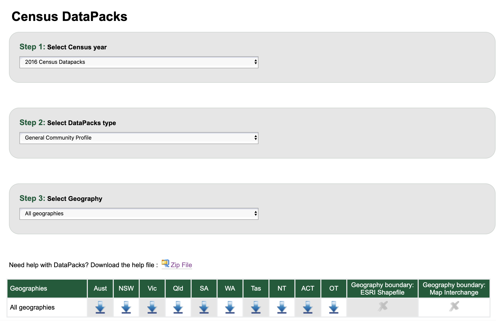

```{r, include = FALSE}
current_file <- knitr::current_input()
basename <- gsub(".Rmd$", "", current_file)

knitr::opts_chunk$set(
  fig.path = sprintf("images/%s/", basename),
  fig.width = 6,
  fig.height = 4,
  fig.align = "center",
  fig.retina = 3,
  echo = TRUE,
  warning = FALSE,
  message = FALSE,
  cache = FALSE,
  cache.path = "cache/"
)
```

```{r titleslide, child="assets/titleslide.Rmd"}
```


---

# Population data

Recall from lecture 2:

.blockquote[
Collecting data on the entire population is normally too expensive or infeasible!  (If we can, it is called a census.) 

We therefore collect data only on a subset of the population.

]

--

* There are exceptions to this and one such example, as mentioned, is the .monash-blue[**census**].

--

.question-box[
1. When was the last time that the Australian census was run?
1. How often is the census conducted in Australia?
{{content}}
]

--

1. Why do we run the census?
1. What data does the Australian census collect?


---

class: bg-gray

.flex[
.w-50[
## Sample survey
]
.w-45[
## Census
]
]

<div class="w-10 absolute right-0 rotate" style="top:30%;">
<b>Advantages</b>
</div>

<div class=" w-10 absolute right-0 rotate" style="top:70%;">
<b>Disadvantages</b>
</div>


.flex.h-40[
.w-50.monash-bg-blue.pa2.white[
]
.w-45.bg-white[
]]

.flex.h-45[
.w-50.bg-white[
]
.w-45.monash-bg-blue.white[

]]


---

count: false


class: bg-gray

.flex[
.w-50[
## Sample survey
]
.w-45[
## Census
]
]

<div class="w-10 absolute right-0 rotate" style="top:30%;">
<b>Advantages</b>
</div>

<div class=" w-10 absolute right-0 rotate" style="top:70%;">
<b>Disadvantages</b>
</div>


.flex.h-40[
.w-50.monash-bg-blue.pa2.white[

* Reduces cost
* Timely collection of data


]
.w-45.bg-white[

* Data available, even for small geographical areas or subpopulations
* Statistics are not subject to sampling error
* Better accuracy and details

]]

.flex.h-45[
.w-50.bg-white[

* Lack of data on sub-population (particularly minorities) or small geographical areas
* Requires careful construction of sampling design
* Estimates are subject to sampling error
* The estimates may not be accurate or reliable 
* Estimating and communicating precision of estimates is difficult

]
.w-45.monash-bg-blue.white[

* Expensive or infeasible
* Time consuming to collect all data

]

]

---


# Australian Bureau of Statistics (ABS) 

.flex[
.w-65[

* ABS is the independent statistical agency of the Government of Australia. 
{{content}}

]
.w-30.center[


]]

--

* If you are from outside Australia, find the statistical government agency in your country <i class="fas fa-wrench gray"></i>, e.g. 
  * in 🇯🇵 Japan, this is the [Statistics Bureau of Japan](https://www.stat.go.jp/english/),
  * in 🇨🇳 China, the [National Bureau of Statistics of China](http://www.stats.gov.cn/english/),
  * in 🇮🇳 India, the [Ministry of Statistics and Programme Implementation](http://mospi.nic.in/), and
  * in 🇳🇿 New Zealand, the [Statistics New Zealand](https://www.stats.govt.nz/).

{{content}}
--

* ABS provides key statistics on a wide range of economic, population, environmental and social issues, to assist and encourage informed decision making, research and discussion within governments and the community.


---

# ABS Census Data

.flex[
.w-50[
* The first Australian census was held in 1911. 
{{content}}
]
.w-50.center[


]]

--

* Since 1961, the census occurs *every 5 years* in Australia.
{{content}}
--

* The census in 2016 at a *cost of $440 million*.
{{content}}
--

* The next census will be held in 2026!
{{content}}
--

* The ABS is legislated to collect and disseminate census data under the *ABS Act 1975* and *Census and Statistics Act 1905*. 
{{content}}
--

* Similar legislation are in place in many countries. 

---


# Getting the ABS Census Data 

## .animated.flash[<i class="fas fa-database"></i> https://www.abs.gov.au/census/find-census-data]

There are two main types of data that you can download:

* **DataPacks** <i class="fas fa-download"></i> https://datapacks.censusdata.abs.gov.au/datapacks/
* GeoPackages <i class="fas fa-download"></i> https://datapacks.censusdata.abs.gov.au/geopackages/




---


# Navigating ABS Census data

.flex[
.w-65[
* The DataPacks is available only for the 2011 and 2016 census.
{{content}}

]
]

--
* There are slight differences in the available profiles between years, e.g. the General Community Profile in 2016 is a replacement for Basic and Expanded Community Profiles in 2011.
{{content}}
--
* The information related the census are detailed on the website. See for example [here](https://www.abs.gov.au/ausstats/abs@.nsf/mf/2901.0).
{{content}}
--
* Note: there are sometimes [data corrections](https://www.abs.gov.au/websitedbs/D3310114.nsf/home/2016%20Census%20Data%20Corrections) at a later date.
{{content}}
--

<div class="idea-box">
Navigating data and deducing what it is often requires you to do some <b>"detective work"</b> 🕵️‍♀️</li>
</div>

* Much like real detective work, *__just locating the data and understanding the data variables can take a long time__*; the work often is not glamorous; and there's far more attention in "catching criminals" (the discoveries from statistical analysis).

---

class: center middle bg-gray

.aim-box.w-70.tl[
Today, 

* We'll navigate through the **personal income data from the 2016 census** together for you to get some "detective" experience
* You'll learn to manipulate strings and a bit about **regular expressions** to deal with string data. 
* You'll learn about **tidy data**. 
]


---

# DataPack directory structure

<div class="flex">
<div class="tree w-50">
<ul class="directory-list">
  <li>
    <i class="fa fa-folder-open"></i>
    2016_GCP_ALL_for_Vic_short-header
    <ul>
      <li>
        <i class="fa fa-folder-open"></i>
        2016 Census GCP All Geographies for VIC
            <ul>
              <li>
                <i class="fa fa-folder-open"></i>
                CED
                <ul>
                  <li>
                    <i class="fa fa-folder-open"></i>
                    VIC
                  <ul>
                  <li>
                    <i class="fa fa-file"></i>
                    2016Census_G01_VIC_CED.csv
                  </li>
                  <li>
                    <i class="fa fa-file"></i>
                    2016Census_G02_VIC_CED.csv
                  </li>
                  <li>
                    ...
                  </li>
                  </ul>
                  </li>
                </ul>
              </li>
              <li>
                <i class="fa fa-folder-open"></i>
                GCCSA
                <ul>
                  <li>
                    <i class="fa fa-folder-open"></i>
                    VIC
                  <ul>
                    <li>
                      <i class="fa fa-file"></i>
                      2016Census_G01_VIC_GCCSA.csv
                    </li>
                    <li>
                      <i class="fa fa-file"></i>
                      2016Census_G01_VIC_GCCSA.csv
                    </li>
                    <li>
                      ...
                    </li>
                  </ul>
                  </li>
                </ul>
              </li>
              <li>
                <i class="fa fa-folder-open"></i>
                LGA
                <ul>
                  <li>
                    <i class="fa fa-folder-open"></i>
                    VIC
                  <ul>
                  <li>
                    <i class="fa fa-file"></i>
                    2016Census_G01_VIC_LGA.csv
                  </li>
                  <li>
                    <i class="fa fa-file"></i>
                    2016Census_G02_VIC_LGA.csv
                  </li>
                  <li>
                    ...
                  </li>
                </ul>
                  </li>
            </ul>
          </li>
          <li>
                <i class="fa fa-folder-open"></i>
                POA
                <ul>
                  <li>
                    <i class="fa fa-folder-open"></i>
                    VIC
                  <ul>
                  <li>
                    <i class="fa fa-file"></i>
                    2016Census_G01_VIC_POA.csv
                  </li>
                  <li>
                    <i class="fa fa-file"></i>
                    2016Census_G02_VIC_POA.csv
                  </li>
                  <li>
                    ...
                  </li>
                </ul>
              </li>
            </ul>
          </li>
          <li>
                <i class="fa fa-folder-open"></i>
                RA
                <ul>
                  <li>
                    <i class="fa fa-folder-open"></i>
                    VIC
                  <ul>
                  <li>
                    <i class="fa fa-file"></i>
                    2016Census_G01_VIC_RA.csv
                  </li>
                  <li>
                    <i class="fa fa-file"></i>
                    2016Census_G02_VIC_RA.csv
                  </li>
                  <li>
                    ...
                  </li>
                </ul>
              </li>
            </ul>
          </li>
          <li>
                <i class="fa fa-folder-open"></i>
                SA1
                <ul>
                  <li>
                    <i class="fa fa-folder-open"></i>
                    VIC
                  <ul>
                  <li>
                    <i class="fa fa-file"></i>
                    2016Census_G01_VIC_SA1.csv
                  </li>
                  <li>
                    <i class="fa fa-file"></i>
                    2016Census_G92_VIC_SA1.csv
                  </li>
                  <li>
                    ...
                  </li>
                </ul>
              </li>
            </ul>
          </li>
          <li>
                <i class="fa fa-folder-open"></i>
                SA2
                <ul>
                  <li>
                    <i class="fa fa-folder-open"></i>
                    VIC
                  <ul>
                  <li>
                    <i class="fa fa-file"></i>
                    2016Census_G01_VIC_SA2.csv
                  </li>
                  <li>
                    <i class="fa fa-file"></i>
                    2016Census_G02_VIC_SA2.csv
                  </li>
                  <li>
                    ...
                  </li>
                </ul>
              </li>
            </ul>
          </li>
          <li><i class="fa fa-folder-open"></i>
                SA3
                <ul>
                  <li>
                    <i class="fa fa-folder-open"></i>
                    VIC
                  <ul>
                  <li>
                    <i class="fa fa-file"></i>
                    2016Census_G01_VIC_SA3.csv
                  </li>
                  <li>
                    <i class="fa fa-file"></i>
                    2016Census_G01_VIC_SA3.csv
                  </li>
                  <li>
                    ...
                  </li>
                </ul>
              </li>
            </ul>
          </li>
          <li>
              <i class="fa fa-folder-open"></i>
                SA4
                <ul>
                  <li>
                    <i class="fa fa-folder-open"></i>
                    VIC
                  <ul>
                  <li>
                    <i class="fa fa-file"></i>
                    2016Census_G01_VIC_SA4.csv
                  </li>
                  <li>
                    <i class="fa fa-file"></i>
                    2016Census_G02_VIC_SA4.csv
                  </li>
                  <li>
                    ...
                  </li>
                </ul>
              </li>
            </ul>
          </li>
          <li>
                <i class="fa fa-folder-open"></i>
                SED
                <ul>
                  <li>
                    <i class="fa fa-folder-open"></i>
                    VIC
                  <ul>
                  <li>
                    <i class="fa fa-file"></i>
                    2016Census_G01_VIC_SED.csv
                  </li>
                  <li>
                    <i class="fa fa-file"></i>
                    2016Census_G02_VIC_SED.csv
                  </li>
                  <li>
                    ...
                  </li>
                </ul>
              </li>
            </ul>
          </li>
          <li>
                <i class="fa fa-folder-open"></i>
                SOS
                <ul>
                  <li>
                    <i class="fa fa-folder-open"></i>
                    VIC
                  <ul>
                  <li>
                    <i class="fa fa-file"></i>
                    2016Census_G01_VIC_SOS.csv
                  </li>
                  <li>
                    <i class="fa fa-file"></i>
                    2016Census_G02_VIC_SOS.csv
                  </li>
                  <li>
                    ...
                  </li>
                </ul>
              </li>
            </ul>
          </li>
          <li>
                <i class="fa fa-folder-open"></i>
                SOSR
                <ul>
                  <li>
                    <i class="fa fa-folder-open"></i>
                    VIC
                  <ul>
                  <li>
                    <i class="fa fa-file"></i>
                    2016Census_G01_VIC_SOSR.csv
                  </li>
                  <li>
                    <i class="fa fa-file"></i>
                    2016Census_G02_VIC_SOSR.csv
                  </li>
                  <li>
                    ...
                  </li>
                </ul>
              </li>
            </ul>
          </li>
          <li>
                <i class="fa fa-folder-open"></i>
                SSC
                <ul>
                  <li>
                    <i class="fa fa-folder-open"></i>
                    VIC
                  <ul>
                  <li>
                    <i class="fa fa-file"></i>
                    2016Census_G01_VIC_SSC.csv
                  </li>
                  <li>
                    <i class="fa fa-file"></i>
                    2016Census_G02_VIC_SSC.csv
                  </li>
                  <li>
                    ...
                  </li>
                </ul>
              </li>
            </ul>
          </li>
          <li>
                <i class="fa fa-folder-open"></i>
                STE
                <ul>
                  <li>
                    <i class="fa fa-folder-open"></i>
                    VIC
                  <ul>
                  <li>
                    <i class="fa fa-file"></i>
                    2016Census_G01_VIC_STE.csv
                  </li>
                  <li>
                    <i class="fa fa-file"></i>
                    2016Census_G02_VIC_STE.csv
                  </li>
                  <li>
                    ...
                  </li>
                </ul>
              </li>
            </ul>
          </li>
          <li>
                <i class="fa fa-folder-open"></i>
                SUA
                <ul>
                  <li>
                    <i class="fa fa-folder-open"></i>
                    VIC
                  <ul>
                  <li>
                    <i class="fa fa-file"></i>
                    2016Census_G01_VIC_SUA.csv
                  </li>
                  <li>
                    <i class="fa fa-file"></i>
                    2016Census_G02_VIC_SUA.csv
                  </li>
                  <li>
                    ...
                  </li>
                </ul>
              </li>
            </ul>
          </li>
          <li>
                <i class="fa fa-folder-open"></i>
                UCL
                <ul>
                  <li>
                    <i class="fa fa-folder-open"></i>
                    VIC
                  <ul>
                  <li>
                    <i class="fa fa-file"></i>
                    2016Census_G01_VIC_UCL.csv
                  </li>
                  <li>
                    <i class="fa fa-file"></i>
                    2016Census_G02_VIC_UCL.csv
                  </li>
                  <li>
                    ...
                  </li>
                </ul>
              </li>
            </ul>
          </li>
        </ul>
      </li>
      <li>
          <i class="fa fa-folder-open"></i>
            Metadata
          <ul>
          <li>
            <i class="fa fa-file"></i>
            2016_GCP_Sequential_Template.xlsx
          </li>
          <li>
            <i class="fa fa-file"></i>
            2016Census_geog_desc_1st_2nd_3rd_release.xlsx
          </li>
          <li>
            <i class="fa fa-file"></i>
            Metadata_2016_GCP_DataPack.xlsx
          </ul></li>
      <li>
            <i class="fa fa-folder-open"></i>
            Readme
          <ul>
          <li>
            <i class="fa fa-file"></i>
            2016POA_readme.txt
          </li>
          <li>
            <i class="fa fa-file"></i>
            AboutDatapacks_readme.txt
          </li>
          <li>
            <i class="fa fa-file"></i>
            CreativeCommons_Licensing_readme.txt
          </li>
          <li>
            <i class="fa fa-file"></i>
            esri_arcmap_readme.txt
          </li>
          <li>
            <i class="fa fa-file"></i>
            Formats_readme.txt
          </li>
          <li>
            <i class="fa fa-file"></i>
            mapinfo_readme.txt
          </li>
          <li>
            <i class="fa fa-file"></i>
            Summary_of_Changes.txt
          </li>
        </ul>
      </li>
    </ul>
</div>

<div class="w-45">
<ul>
<li>The data is nested within folders. <Br><span class="f6">Click on the folder name to see folders and files nested within.</span></li>
{{content}}
</ul>
</div>
</div>

<script>
// get all folders in our .directory-list
var allFolders = $(".directory-list li > ul");
allFolders.each(function() {

	  // add the folder class to the parent <li>
	  var folderAndName = $(this).parent();
	  folderAndName.addClass("folder");

	  // backup this inner <ul>
	  var backupOfThisFolder = $(this);
	  // then delete it
	  $(this).remove();
	  // add an <a> tag to whats left ie. the folder name
	  folderAndName.wrapInner("<a href='#' />");
	  // then put the inner <ul> back
	  folderAndName.append(backupOfThisFolder);

	  // now add a slideToggle to the <a> we just added
	  folderAndName.find("a").click(function(e) {
	    $(this).siblings("ul").slideToggle("slow");
	    e.preventDefault();
	  });
	  
	  folderAndName.find("a").click();

	});
</script>

--

<li>Preserve the data in the original structure as much as you can! That is, <b>don't modify the data</b>!</li>
{{content}}
--

<li>Where do we get started??</li>


---

# Getting started

* First, pray hard that there is some description!

--

* Without some description or understanding of the variables, it will be near impossible to extract meaningful information from the data. 
--

<div class="flex">
<div class="tree w-50">
<ul>
<li><i class="fa fa-folder-open"></i>
    2016_GCP_ALL_for_Vic_short-header
</li>
<li><i class="fa fa-folder-open"></i> Metadata
<ul><li><i class="fa fa-file"></i> 2016_GCP_Sequential_Template.xlsx
</li>
<li><i class="fa fa-file"></i> 2016Census_geog_desc_1st_2nd_3rd_release.xlsx</li>
<li><i class="fa fa-file"></i> Metadata_2016_GCP_DataPack.xlsx
</ul></li>
<li>
<i class="fa fa-folder-open"></i>
Readme
<ul>
<li>
 <i class="fa fa-file"></i>
 2016POA_readme.txt
</li>
<li>
 <i class="fa fa-file"></i>
 AboutDatapacks_readme.txt
</li>
<li>
   <i class="fa fa-file"></i>
   CreativeCommons_Licensing_readme.txt
 </li>
 <li>
   <i class="fa fa-file"></i>
   esri_arcmap_readme.txt
 </li>
 <li>
   <i class="fa fa-file"></i>
   Formats_readme.txt
 </li>
 <li>
   <i class="fa fa-file"></i>
   mapinfo_readme.txt
 </li>
 <li>
   <i class="fa fa-file"></i>
   Summary_of_Changes.txt
 </li>
</ul>
</li>
</ul>
</div>
<div class="w-45">
<ul>
<li>Readme is a good place to start here (phew!)</li>
</ul>
<blockquote>
"About DataPacks_readme.md - "Read Me" documentation containing helpful information for users about the data and how it is structured (.md)"
</blockquote>
<ul>
<li> <i>But there is no `DataPacks_readme.md`??</i></li>
{{content}}
</ul>

</div>
</div>

--
<li>We go through other files in the Readme.</li>


---

# Meta-data

<div class="tree w-50">
<ul>
<li><i class="fa fa-folder-open"></i>
    2016_GCP_ALL_for_Vic_short-header
</li>
<li><i class="fa fa-folder-open"></i> Metadata
<ul><li><i class="fa fa-file"></i> 2016_GCP_Sequential_Template.xlsx
</li>
<li><i class="fa fa-file"></i> 2016Census_geog_desc_1st_2nd_3rd_release.xlsx</li>
<li><i class="fa fa-file"></i> Metadata_2016_GCP_DataPack.xlsx
</ul></li>
<li>
<i class="fa fa-folder-open"></i>
Readme
</li>
</ul>
</div>

We could also try going through the meta-data.


--

.monash-blue[`Metadata_2016_GCP_DataPack.xlsx`]

<br>

```{r, echo = F}
DT::datatable(tibble::tibble(`Table number` = c("G17", "G28", "G29", "..."), `Table name` = c("Total Personal Income (Weekly) by Age by Sex", "Total Family Income (Weekly) by Family Composition", "Total Household Income (Weekly) by Household Composition", "..."), `Table population` = c("Persons aged 15 years and over ", "Families in family households", "Occupied private dwellings", "...")),
              height = 200,
              rownames = FALSE,
              options = list(lengthChange = FALSE, dom = "t", scrollY = "100px"))

```

---

# Finding Table G17


<div class="flex">
<div class="tree w-50">

<ul>
  <li>
    <i class="fa fa-folder-open"></i>
    2016_GCP_ALL_for_Vic_short-header
    <ul>
      <li>
        <i class="fa fa-folder-open"></i>
        2016 Census GCP All Geographies for VIC
        <ul class="directory-list">
          <li>
            <i class="fa fa-folder-open"></i>
            CED
            <ul>
              <li>
                <i class="fa fa-folder-open"></i>
                VIC
                <ul>
                <li>...</li>
                  <li>
                    <i class="fa fa-file"></i>
                    2016Census_G17A_VIC_CED.csv
                  </li>
                  <li>
                    <i class="fa fa-file"></i>
                    2016Census_G17B_VIC_CED.csv
                  </li>
                  <li>
                    <i class="fa fa-file"></i>
                    2016Census_G17C_VIC_CED.csv
                  </li>
                  <li>...</li>
                </ul>
              </li>
            </ul>
          </li>
          <li>
            <i class="fa fa-folder-open"></i>
            GCCSA
            <ul>
              <li>
                <i class="fa fa-folder-open"></i>
                VIC
                <ul>
                <li>...</li>
                  <li>
                    <i class="fa fa-file"></i>
                    2016Census_G17A_VIC_GCCSA.csv
                  </li>
                  <li>
                    <i class="fa fa-file"></i>
                    2016Census_G17B_VIC_GCCSA.csv
                  </li>
                  <li>
                    <i class="fa fa-file"></i>
                    2016Census_G17C_VIC_GCCSA.csv
                  </li>
                  <li>...</li>
                </ul>
              </li>
            </ul>
          </li>
          <li>
            <i class="fa fa-folder-open"></i>
            LGA
            <ul>
              <li>
                <i class="fa fa-folder-open"></i>
                VIC
                <ul>
                <li>...</li>
                  <li>
                    <i class="fa fa-file"></i>
                    2016Census_G17A_VIC_LGA.csv
                  </li>
                  <li>
                    <i class="fa fa-file"></i>
                    2016Census_G17B_VIC_LGA.csv
                  </li>
                  <li>
                    <i class="fa fa-file"></i>
                    2016Census_G17C_VIC_LGA.csv
                  </li>
                  <li>...</li>
                </ul>
              </li>
            </ul>
          </li>
          <li>
            <i class="fa fa-folder-open"></i>
            POA
            <ul>
              <li>
                <i class="fa fa-folder-open"></i>
                VIC
                <ul>
                <li>...</li>
                  <li>
                    <i class="fa fa-file"></i>
                    2016Census_G17A_VIC_POA.csv
                  </li>
                  <li>
                    <i class="fa fa-file"></i>
                    2016Census_G17B_VIC_POA.csv
                  </li>
                  <li>
                    <i class="fa fa-file"></i>
                    2016Census_G17C_VIC_POA.csv
                  </li>
                  <li>...</li>
                </ul>
              </li>
            </ul>
          </li>
          <li>
            <i class="fa fa-folder-open"></i>
            RA
            <ul>
              <li>
                <i class="fa fa-folder-open"></i>
                VIC
                <ul>
                <li>...</li>
                  <li>
                    <i class="fa fa-file"></i>
                    2016Census_G17A_VIC_RA.csv
                  </li>
                  <li>
                    <i class="fa fa-file"></i>
                    2016Census_G17B_VIC_RA.csv
                  </li>
                  <li>
                    <i class="fa fa-file"></i>
                    2016Census_G17C_VIC_RA.csv
                  </li>
                  <li>...</li>
                </ul>
              </li>
            </ul>
          </li>
          <li>
            <i class="fa fa-folder-open"></i>
            SA1
            <ul>
              <li>
                <i class="fa fa-folder-open"></i>
                VIC
                <ul>
                <li>...</li>
                  <li>
                    <i class="fa fa-file"></i>
                    2016Census_G17A_VIC_SA1.csv
                  </li>
                  <li>
                    <i class="fa fa-file"></i>
                    2016Census_G17B_VIC_SA1.csv
                  </li>
                  <li>
                    <i class="fa fa-file"></i>
                    2016Census_G17C_VIC_SA1.csv
                  </li>
                  <li>...</li>
                </ul>
              </li>
            </ul>
          </li>
          <li>
            <i class="fa fa-folder-open"></i>
            SA2
            <ul>
              <li>
                <i class="fa fa-folder-open"></i>
                VIC
                <ul>
                <li>...</li>
                  <li>
                    <i class="fa fa-file"></i>
                    2016Census_G17A_VIC_SA2.csv
                  </li>
                  <li>
                    <i class="fa fa-file"></i>
                    2016Census_G17B_VIC_SA2.csv
                  </li>
                  <li>
                    <i class="fa fa-file"></i>
                    2016Census_G17C_VIC_SA2.csv
                  </li>
                  <li>...</li>
                </ul>
              </li>
            </ul>
          </li>
          <li>
            <i class="fa fa-folder-open"></i>
            SA3
            <ul>
              <li>
                <i class="fa fa-folder-open"></i>
                VIC
                <ul>
                <li>...</li>
                  <li>
                    <i class="fa fa-file"></i>
                    2016Census_G17A_VIC_SA3.csv
                  </li>
                  <li>
                    <i class="fa fa-file"></i>
                    2016Census_G17B_VIC_SA3.csv
                  </li>
                  <li>
                    <i class="fa fa-file"></i>
                    2016Census_G17C_VIC_SA3.csv
                  </li>
                  <li>...</li>
                </ul>
              </li>
            </ul>
          </li>
          <li>
            <i class="fa fa-folder-open"></i>
            SA4
            <ul>
              <li>
                <i class="fa fa-folder-open"></i>
                VIC
                <ul>
                <li>...</li>
                  <li>
                    <i class="fa fa-file"></i>
                    2016Census_G17A_VIC_SA4.csv
                  </li>
                  <li>
                    <i class="fa fa-file"></i>
                    2016Census_G17B_VIC_SA4.csv
                  </li>
                  <li>
                    <i class="fa fa-file"></i>
                    2016Census_G17C_VIC_SA4.csv
                  </li>
                  <li>...</li>
                </ul>
              </li>
            </ul>
          </li>
          <li>
            <i class="fa fa-folder-open"></i>
            SED
            <ul>
              <li>
                <i class="fa fa-folder-open"></i>
                VIC
                <ul>
                <li>...</li>
                  <li>
                    <i class="fa fa-file"></i>
                    2016Census_G17A_VIC_SED.csv
                  </li>
                  <li>
                    <i class="fa fa-file"></i>
                    2016Census_G17B_VIC_SED.csv
                  </li>
                  <li>
                    <i class="fa fa-file"></i>
                    2016Census_G17C_VIC_SED.csv
                  </li>
                  <li>...</li>
                </ul>
              </li>
            </ul>
          </li>
          <li>
            <i class="fa fa-folder-open"></i>
            SOS
            <ul>
              <li>
                <i class="fa fa-folder-open"></i>
                VIC
                <ul>
                <li>...</li>
                  <li>
                    <i class="fa fa-file"></i>
                    2016Census_G17A_VIC_SOS.csv
                  </li>
                  <li>
                    <i class="fa fa-file"></i>
                    2016Census_G17B_VIC_SOS.csv
                  </li>
                  <li>
                    <i class="fa fa-file"></i>
                    2016Census_G17C_VIC_SOS.csv
                  </li>
                  <li>...</li>
                </ul>
              </li>
            </ul>
          </li>
          <li>
            <i class="fa fa-folder-open"></i>
            SOSR
            <ul>
              <li>
                <i class="fa fa-folder-open"></i>
                VIC
                <ul>
                <li>...</li>
                  <li>
                    <i class="fa fa-file"></i>
                    2016Census_G17A_VIC_SOSR.csv
                  </li>
                  <li>
                    <i class="fa fa-file"></i>
                    2016Census_G17B_VIC_SOSR.csv
                  </li>
                  <li>
                    <i class="fa fa-file"></i>
                    2016Census_G17C_VIC_SOSR.csv
                  </li>
                  <li>...</li>
                </ul>
              </li>
            </ul>
          </li>
          <li>
            <i class="fa fa-folder-open"></i>
            SSC
            <ul>
              <li>
                <i class="fa fa-folder-open"></i>
                VIC
                <ul>
                <li>...</li>
                  <li>
                    <i class="fa fa-file"></i>
                    2016Census_G17A_VIC_SSC.csv
                  </li>
                  <li>
                    <i class="fa fa-file"></i>
                    2016Census_G17B_VIC_SSC.csv
                  </li>
                  <li>
                    <i class="fa fa-file"></i>
                    2016Census_G17C_VIC_SSC.csv
                  </li>
                  <li>...</li>
                </ul>
              </li>
            </ul>
          </li>
          <li>
            <i class="fa fa-folder-open"></i>
            STE
            <ul>
              <li>
                <i class="fa fa-folder-open"></i>
                VIC
                <ul>
                <li>...</li>
                  <li>
                    <i class="fa fa-file"></i>
                    2016Census_G17A_VIC_STE.csv
                  </li>
                  <li>
                    <i class="fa fa-file"></i>
                    2016Census_G17B_VIC_STE.csv
                  </li>
                  <li>
                    <i class="fa fa-file"></i>
                    2016Census_G17C_VIC_STE.csv
                  </li>
                  <li>...</li>
                </ul>
              </li>
            </ul>
          </li>
          <li>
            <i class="fa fa-folder-open"></i>
            SUA
            <ul>
              <li>
                <i class="fa fa-folder-open"></i>
                VIC
                <ul>
                <li>...</li>
                  <li>
                    <i class="fa fa-file"></i>
                    2016Census_G17A_VIC_SUA.csv
                  </li>
                  <li>
                    <i class="fa fa-file"></i>
                    2016Census_G17B_VIC_SUA.csv
                  </li>
                  <li>
                    <i class="fa fa-file"></i>
                    2016Census_G17C_VIC_SUA.csv
                  </li>
                  <li>...</li>
                </ul>
              </li>
            </ul>
          </li>
          <li>
            <i class="fa fa-folder-open"></i>
            UCL
            <ul>
              <li>
                <i class="fa fa-folder-open"></i>
                VIC
                <ul>
                <li>...</li>
                  <li>
                    <i class="fa fa-file"></i>
                    2016Census_G17A_VIC_UCL.csv
                  </li>
                  <li>
                    <i class="fa fa-file"></i>
                    2016Census_G17B_VIC_UCL.csv
                  </li>
                  <li>
                    <i class="fa fa-file"></i>
                    2016Census_G17C_VIC_UCL.csv
                  </li>
                  <li>...</li>
                </ul>
              </li>
            </ul>
          </li>
        </ul>
      </li>
      <li>
        <i class="fa fa-folder-open"></i>
        Metadata
      </li>
      <li>
        <i class="fa fa-folder-open"></i>
        Readme
      </li>
    </ul>
  </li>
</ul>
</div>
<div class="w-45">
<li>Where is Table G17?</li>
<li>Which Table G17?</li>
</div>
</div>

---

# Back to metadata

<div class="tree">
<ul>
      <li>
        <i class="fa fa-folder-open"></i>
        Metadata
        <ul>
          <li>
            <i class="fa fa-file"></i>
            2016_GCP_Sequential_Template.xlsx
          </li>
          <li>
            <i class="fa fa-file"></i>
            2016Census_geog_desc_1st_2nd_3rd_release.xlsx
          </li>
          <li>
            <i class="fa fa-file"></i>
            Metadata_2016_GCP_DataPack.xlsx
          </li>
        </ul>
      </li>
    </ul>
  </li>
</ul>
</div>

Let's open .monash-blue[`2016Census_geog_desc_1st_2nd_3rd_release.xlsx`]

--

... and there are the region names of each geographical code.

--

<br>

Let's go with the easy one: .monash-blue[`STE` Victoria].


---

# Found Table G17?

<div class="tree"
<ul>
  <li>
    <i class="fa fa-folder-open"></i>
    2016_GCP_ALL_for_Vic_short-header
    <ul>
      <li>
        <i class="fa fa-folder-open"></i>
        2016 Census GCP All Geographies for VIC
        <ul>
        <li>...</li>
          <li>
            <i class="fa fa-folder-open"></i>
            STE
            <ul>
              <li>
                <i class="fa fa-folder-open"></i>
                VIC
                <ul>
            <li>...</li>
                  <li>
                    <i class="fa fa-file"></i>
                    2016Census_G17A_VIC_STE.csv
                  </li>
                  <li>
                    <i class="fa fa-file"></i>
                    2016Census_G17B_VIC_STE.csv
                  </li>
                  <li>
                    <i class="fa fa-file"></i>
                    2016Census_G17C_VIC_STE.csv
                  </li>
            <li>...</li>
                </ul>
              </li>
              
            </ul>
            <li>...</li>
          </li>
</ul>
</div>

* G17A, G17B, G17C?

<br>
.center[
.box[Why is the table organised like this?]
]


---

# Tables G17A-G17C

```{r, echo = F}
dfA <- read.csv(here::here("data/2016_GCP_ALL_for_Vic_short-header/2016 Census GCP All Geographies for VIC/STE/VIC/2016Census_G17A_VIC_STE.csv"))
dfB <- read.csv(here::here("data/2016_GCP_ALL_for_Vic_short-header/2016 Census GCP All Geographies for VIC/STE/VIC/2016Census_G17B_VIC_STE.csv"))
dfC <- read.csv(here::here("data/2016_GCP_ALL_for_Vic_short-header/2016 Census GCP All Geographies for VIC/STE/VIC/2016Census_G17C_VIC_STE.csv"))
```

.f3[.monash-gray80[2016Census_G17]A.monash-gray80[_VIC_STE.csv]]

```{r, echo = F}
DT::datatable(dfA,
              rownames = FALSE, 
              options = list(lengthChange = FALSE, dom = "t",
                             pageLength = nrow(dfA),
                             scrollX = "100px"))
```

<br>

.f3[.monash-gray80[2016Census_G17]B.monash-gray80[_VIC_STE.csv]]

```{r, echo = F}
DT::datatable(dfB,
              rownames = FALSE,
              options = list(lengthChange = FALSE, dom = "t",
                             scrollX = "100px"))
```

<br>

.f3[.monash-gray80[2016Census_G17]C.monash-gray80[_VIC_STE.csv]]

```{r, echo = F}
DT::datatable(dfC,
              rownames = FALSE,
              options = list(lengthChange = FALSE, dom = "t",
                             scrollX = "100px"))
```

---

# Table G17

.w-60[
There are few things to note:

* There are 201 columns in G17A and G17B and 81 columns in G17C. 
* Perhaps there is an export limitation for a data that contains more than 200 columns, thus it is broken up into different csv files.
* Which means that you have to join the tables G17A, G17B and G17C as one (you'll do this in the tutorial <i class="fas fa-wrench gray"></i>).

]

<br>

.question-box[
But what does the data show?
]


---

# What is Tidy Data?

<br>

.info-box[

## Tidy Data Principles

1. Each variable must have its own column
2. Each observation must have its own row
3. Each value must have its own cell
]

{{content}}


.footnote[
Wickham (2014) Tidy Data. *Journal of Statistical Software* **59**
]

--

So what about the ABS 2016 Census Data?

* The table header in fact contains information!
* E.g. <span class="monash-blue2">`F_400_499_15_19_yrs`</span> is female aged 15-19 years old who earn $400-499 per week (in Victoria).
* The number in the cells are the **counts**.
* Is the data tidy?

---

# Tidying the ABS 2016 Census Data

* Ideally we want the data to look like:

<br>

```{r, echo = FALSE}
DT::datatable(tibble::tibble(age_min = 15, age_max = 19, gender = "female", 
                             income_min = 400, income_max = 499, count = 4020),
              rownames = FALSE, 
              options = list(lengthChange = FALSE, dom = "t"))
```

* You can include other information, e.g. geography code (useful if combining with other geographical area) or average age/income.

* Note that some don't have upper bounds, e.g. .monash-blue[`M_3000_more_85ov`]. In R, `-Inf` and `Inf` are used to represent $-\infty$ and $\infty$, respectively.

* You'll wrangle the data into the tidy form in tutorial  <i class="fas fa-wrench gray"></i>

---

class: transition

# Manipulating strings 

---

# Manipulating strings 

* The `stringr` package is powered by the `stringi` package which in turn uses the [ICU](http://site.icu-project.org/) C library to provide fast peformance for string manipulation

```{r}
library(tidyverse) # includes `stringr`
```


.footnote.f5[
Hadley Wickham (2019). stringr: Simple, Consistent Wrappers for
  Common String Operations. R package version 1.4.0.
  
Gagolewski M. and others (2020). R package stringi: Character
  string processing facilities.
]

--

* Main functions in `stringr` **prefix with `str_`**  (`stringi` prefix with `stri_`) and the **first argument is string** (or a vector of strings)
--

* What do you think `str_trim` and `str_squish` do?
```{r}
str_trim(c("    Apple ", "  Goji    Berry     "))
str_squish(c("    Apple ", "  Goji    Berry     "))
```

---

# Base R and `stringr`

```{r, echo = FALSE}
baser <- tibble(`Base R` = c("gregexpr(pattern, x)", "grep(pattern, x, value = TRUE)", "grep(pattern, x)", 
"grepl(pattern, x)", "gsub(pattern, replacement, x)", "nchar(x)", 
"order(x)", "regexec(pattern, x) + regmatches()", "regexpr(pattern, x) + regmatches()", 
"regexpr(pattern, x)", "sort(x)", "strrep(x, n)", "strsplit(x, pattern)", 
"strwrap(x)", "sub(pattern, replacement, x)", "substr(x, start, end)", 
"tolower(x)", "tools::toTitleCase(x)", "toupper(x)", "trimws(x)"
),
stringr = c("str_locate_all(x, pattern)", "str_subset(x, pattern)", "str_which(x, pattern)", 
"str_detect(x, pattern)", "str_replace_all(x, pattern, replacement)", 
"str_length(x)", "str_order(x)", "str_match(x, pattern)", "str_extract(x, pattern)", 
"str_locate(x, pattern)", "str_sort(x)", "str_dup(x, n)", "str_split(x, pattern)", 
"str_wrap(x)", "str_replace(x, pattern, replacement)", "str_sub(x, start, end)", 
"str_to_lower(x)", "str_to_title(x)", "str_to_upper(x)", "str_trim(x)"
)
)
DT::datatable(baser, options= list(lengthChange = FALSE,
                                   dom = 'tp',
                                   columnDefs = list(list(className = 'dt-left'))),
              rownames = FALSE)
```

.footnote.f5[
See more at https://stringr.tidyverse.org/articles/from-base.html
]

---

# Why use `stringr`?

* There are a number of considerations to ensure there is consistency in syntax and user expectation (both for input and output)
--

* For example, let's consider <u>combining multiple strings into one</u>.
--
.grid[
.item[
**Base R**

```{r}
paste0("Area", "1", c("A", "B"))
```

]
.item[
**`stringr`**
```{r}
str_c("Area", "1", c("A", "B"))
```
]]

---

count: false

# Why use `stringr`?

* There are a number of considerations to ensure there is consistency in syntax and user expectation (both for input and output)

* For example, let's consider <u>combining multiple strings into one</u>.
.grid[
.item[
**Base R**

```{r}
paste0("Area", "1", c("A", "B"))
```
```{r, eval = FALSE}
paste0("Area", "1", c("A", NA, "C"))
```

]
.item[
**`stringr`**
```{r}
str_c("Area", "1", c("A", "B"))
```
```{r, eval = FALSE}
str_c("Area", "1", c("A", NA, "C"))
```
]]


---

count: false

# Why use `stringr`?

* There are a number of considerations to ensure there is consistency in syntax and user expectation (both for input and output)

* For example, let's consider <u>combining multiple strings into one</u>.
.grid[
.item[
**Base R**

```{r}
paste0("Area", "1", c("A", "B"))
```
```{r}
paste0("Area", "1", c("A", NA, "C"))
```

]
.item[
**`stringr`**
```{r}
str_c("Area", "1", c("A", "B"))
```
```{r}
str_c("Area", "1", c("A", NA, "C"))
```
]]

* If the Base R result is preferable then NA can be replaced with character with .monash-blue[`str_replace_na`]`("A", NA, "C")` first


---

# .orange[Case study <i class="fas fa-search-plus"></i>] Aussie Local Government Area

```{r}
LGA <- ozmaps::abs_lga %>% pull(NAME)
LGA[1:7]
```

<center>
<table style="width:90%">
  <tr>
    <td>C = Cities</td>
    <td>A = Areas</td>
    <td>RC = Rural Cities</td>
    
  </tr>
  <tr>
    <td>B = Boroughs</td>
    <td>S = Shires</td>
    <td>DC = District Councils</td>
  </tr>
  <tr>
    <td>M = Municipalities</td>
    <td>T = Towns</td>
    <td>AC = Aboriginal Councils </td>
  </tr>
  <tr>
  <td>RegC = Regional Councils</td>
  </tr>
</table>
</center>

<br>
.center[
🎯 **Extract the LGA status from the LGA names**

{{content}}
]

.footnote[
Michael Sumner (2020). ozmaps: Australia Maps. R package version
  0.3.6. 
]

--

How?


---

name: lga

# Extracting the string


```{r}
str_extract(LGA, "\\(.+\\)") 
```

--

<div class="info-box" style="position:absolute;right:20px;margin-right:0px!important;bottom:50px;margin-left:0;width:900px;font-size: 20pt;">
<ul>
<li>What is <code>"\\(.+\\)"</code>???</li>
{{content}}
</ul>
</div>

--

<li>This is a pattern expressed as <b>regular expression</b> or <b>regex</b> for short</li>

{{content}}

--

<li>Note in R, you have to add an extra <code>\</code> when  <code>\</code> is included in the pattern <span class="font_small">(yes this means that you can have a lot of backslashes... just keep adding <code>\</code> until it works! Enjoy <a href="https://xkcd.com/1638/">this xkcd comic</a>.)</span></li>

{{content}}

--

<li>From R v4.0.0 onwards, you can use raw string to elimiate all the extra <code>\</code>, e.g. <code>r"(<span class="monash-blue">\(.+\)</span><code>)"</code> is the same as <code class="monash-blue">"\\(.+\\)"</code></li>

---

# Regular expressions .font_small[.font_small[Part] 1]

* **Regular expression**, or **regex**, is a string of characters that define a search pattern for text
--

* Regular expression is... 
--
hard
--
, but comes up often enough that it's worth learning
--

```{r}
ozanimals <- c("koala", "kangaroo", "kookaburra", "numbat")
```
--
**.circle.bg-orange.white[=] Basic match**
.flex[
.w-50.pr3[
```{r}
str_detect(ozanimals, "oo")
str_extract(ozanimals, "oo")
```

]
.w-50[
```{r}
str_match(ozanimals, "oo")
```

]

]

---

# Regular expressions .font_small[.font_small[Part] 2]

**.circle.bg-orange.white[=] Meta-characters**

* `"."` a wildcard to match any character except a new line
```{r}
str_starts(c("color", "colouur", "colour", "red-column"), "col...")
```
--

* `"(.|.)"` a marked subexpression with alternate possibilites marked with `|`
```{r}
str_replace(c("lovelove", "move", "stove", "drove"), "(l|dr|st)o", "ha")
```
--

* `"[...]"` matches a single character contained in the bracket 
```{r}
str_replace_all(c("cake", "cookie", "lamington"), "[aeiou]", "_")
```
---

# Regular expressions .font_small[.font_small[Part] 3]

**.circle.bg-orange.white[=] Meta-character quantifiers**


* `"?"` zero or one occurence of preceding element
```{r}
str_extract(c("color", "colouur", "colour", "red"), "colou?r")
```
--

* `"*"` zero or more occurence of preceding element
```{r}
str_extract(c("color", "colouur", "colour", "red"), "colou*r")
```
--

* `"+"` one or more occurence of preceding element
```{r}
str_extract(c("color", "colouur", "colour", "red"), "colou+r")
```

---

# Regular expressions .font_small[.font_small[Part] 4]

* `"{n}"` preceding element is matched exactly `n` times
```{r}
str_replace(c("banana", "bananana", "bana", "banananana"), "ba(na){2}", "-")
```
--

* `"{min,}"` preceding element is matched `min` times or more
```{r}
str_replace(c("banana", "bananana", "bana", "banananana"), "ba(na){2,}", "-")
```
--

* `"{min,max}"` preceding element is matched at least `min` times but no more than `max` times
```{r}
str_replace(c("banana", "bananana", "bana", "banananana"), "ba(na){1,2}", "-")
```

---

# Regular expressions .font_small[.font_small[Part] 5]

**.circle.bg-orange.white[=] Character classes**

* `[:alpha:]` or `[A-Za-z]` to match alphabetic characters
* `[:alnum:]` or `[A-Za-z0-9]` to match alphanumeric characters
* `[:digit:]` or `[0-9]` or `\\d` to match a digit
* `[^0-9]` to match non-digits  
* `[a-c]` to match a, b or c
* `[A-Z]` to match uppercase letters
* `[a-z]` to match lowercase letters
* `[:space:]` or `[ \t\r\n\v\f]` to match whitespace characters
* and more...

---

# View matches with regular expressions

.grid-row[
.item[
```{r}
str_view(c("banana", "bananana", "bana", "banabanana"), "ba(na){1,2}")
```

]
.item[
```{r}
str_view_all(c("banana", "bananana", "bana", "banabanana"), "ba(na){1,2}")
```
]
]

---

count: false

# View matches with regular expressions

.grid-row[
.item[
```{r}
str_view(c("banana", "bananana", "bana", "banabanana"), "ba(na){1,2}")
```

]
.item[
```{r}
str_view_all(c("banana", "bananana", "bana", "banabanana"), "ba(na){1,2}")
```
]
]

<div class="info-box" style="position:absolute;right:20px;margin-right:0px!important;top:140px;margin-left:0;width:900px;font-size: 20pt;">
<ul>
<li>When a function in <code>stringr</code> ends with <code>_all</code>, all matches of the pattern are considered</li>
<li>The one <i>without</i> <code>_all</code> only considers the first match</li>
</ul>
</div>

---

# .font_small[Back to] Extracting the string

```{r}
str_extract(LGA, "\\(.+\\)")
```

---

count: false

# .font_small[Back to] Extracting the string

```{r}
str_extract(LGA, "\\(.+\\)") %>% 
  table()
```

--

<blockquote>
Where the same Local Government Area name appears in different States or Territories, the State or Territory abbreviation appears in parenthesis after the name. Local Government Area names are therefore unique.<br>
<a href="https://www.abs.gov.au/ausstats/abs@.nsf/Lookup/by%20Subject/1270.0.55.003~June%202020~Main%20Features~Local%20Government%20Areas%20(LGAs)~3" style="float:right">-Australian Bureau of Statistics</a>
</blockquote>

---

# .font_small[Retry] Extracting the string

```{r}
str_extract(LGA, "\\([^)]+\\)") %>% 
  table()
```

---

count: false


# .font_small[Retry] Extracting the string


```{r}
str_extract(LGA, "\\([^)]+\\)") %>% 
  # remove the brackets
  str_replace_all("[\\(\\)]", "") %>% 
  table()
```

* `"[]"` for single character match
* We want to match `(` and `)` but these are meta-characters
* So we need to escape it to have it as a literal: `\(` and `\)`
* But we must escape the escape character... so it's actually `\\(` `\\)`


---

# .font_small[R v4.0.0] Extracting the string


<pre>
<code class="r hljs remark-code">
<div class="remark-code-line">str_extract(LGA, <span style="background-color:yellow">r<span class="hljs-string">"(</span></span><span class="hljs-string">\([^)]+\)<span style="background-color:yellow">)"</span></span>) %&gt;% </div>
<div class="remark-code-line">  <span class="hljs-comment"># remove the brackets</span></div>
<div class="remark-code-line">  str_replace_all(<span style="background-color:yellow">r<span class="hljs-string">"(</span></span><span class="hljs-string">[\(\)]<span style="background-color:yellow">)"</span></span>, <span class="hljs-string">""</span>) %&gt;% </div>
<div class="remark-code-line">  table()</div>
</code>
</pre>
<pre>
<code class="r hljs remark-code"><div class="remark-code-line"><span class="hljs-comment">## .</span></div>
<div class="remark-code-line"><span class="hljs-comment">##    A   AC    B    C   DC    M    R   RC RegC    S    T </span></div>
<div class="remark-code-line"><span class="hljs-comment">##  100    2    1  125   41   27   39    7    1  183   12</span></div>
</code>
</pre>


* If using R v4.0.0 onwards, you can use the raw string version instead


---


class: transition 

# Back to Census

---

# Raw Data vs. Aggregated Data

* Although the data collected was from individual households surveying each person in the household (see sample form [here](https://www.abs.gov.au/ausstats/abs@.nsf/Lookup/2901.0Main%20Features802016/$FILE/2016%20Census%20Sample%20Household%20Form.pdf)), the downloaded data are .monash-blue[aggregated].
* Aggregated data presents summary statistics from the *raw data*. When the only summary statistics are counts then it is generally called *frequency data*.
* The raw data collected would be similar to the form

```{r, echo = FALSE}
DT::datatable(tibble::tibble(household_id = c(1, 1, 1, 1, 2, 2),
                             person = c("John Smith", "Jane Smith", "David Smith", "Mary Smith", "John Citizen", "Jane Citizen"),
                             gender = c("F", "M", "M", "F", "M", "F"),
                             age = c(40, 39, 10, 8, 32, 33),
                             maritial_status = c("Married", "Married", "Never married", "Never married", "Never married", "Never married"),
                             income_per_week = c("400-499", "300-399", "Nil", "Nil", "400-499", "1750-1999")),
              rownames = FALSE,
              options = list(lengthChange = FALSE, dom = "t"))
```

---

# What you lose in aggregate data

* For aggregate data, there are less scope for you to draw insights conditioned on other variables. 
* E.g. based on frequency data alone, you cannot answer questions like: how many middle income families with 2 children?
* Raw data are desirable if you can get hold of it!
--


## Trust and skepticism


* By the way, did you notice anything odd about the dummy data presented in the last slide?
--


* John Smith was recorded as female and Jane Smith as male. Data may have been incorrectly recorded. 
--


* How much do you trust the aggregate data?
* Have some healthy dose of skepticism in your data.


---

# Data Confidentiality

* The data is not just aggregated, but it is also .monash-blue[anonymised]
* E.g. in .monash-blue[`2016_GCP_Sequential_Template.xlsx`], Sheet "G 17a", footnote says "*Please note that there are **small random adjustments** made to all cell values to protect the confidentiality of data. These adjustments may cause the sum of rows or columns to differ by small amounts from table totals.*"

--

.question-box.w-60[
Do you think that you'll get the same numbers if you use the ones from different geographical code? E.g. `SA1` and `STE`. 
]

--

* You can check this in the tutorial 🔧

---

class: bg-gray middle center


.idea-box.tl.w-70[
## Summary
* We went through how to locate and understand the data variables for the personal income data from the 2016 Australian census.
* We know some limitations with this data. 
* We learnt how to manipulate strings and a little about regular expression. 
* We learnt about what tidy data is.
]


---

```{r endslide, child="assets/endslide.Rmd"}
```


